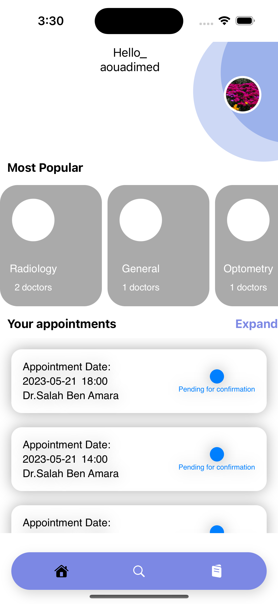
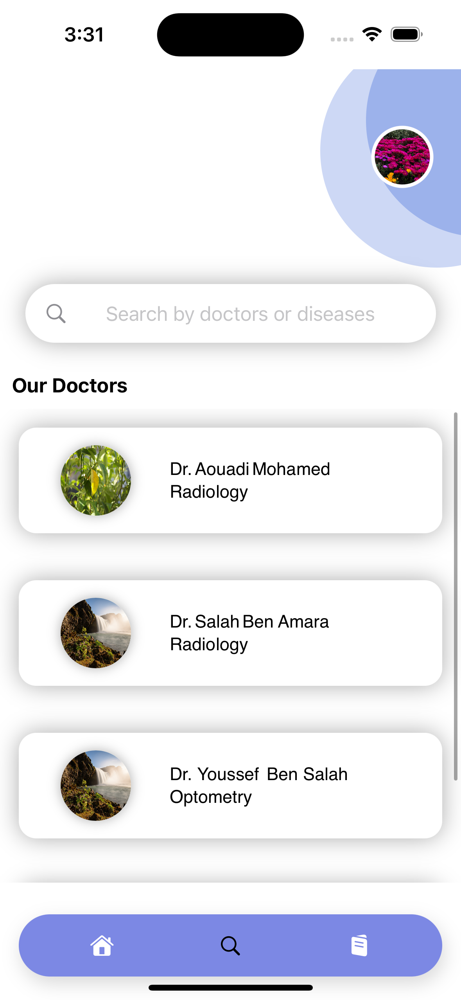
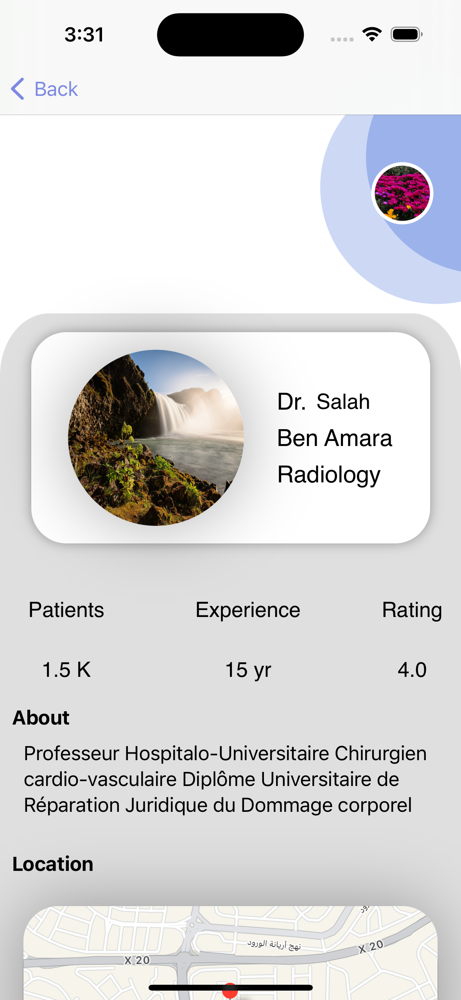
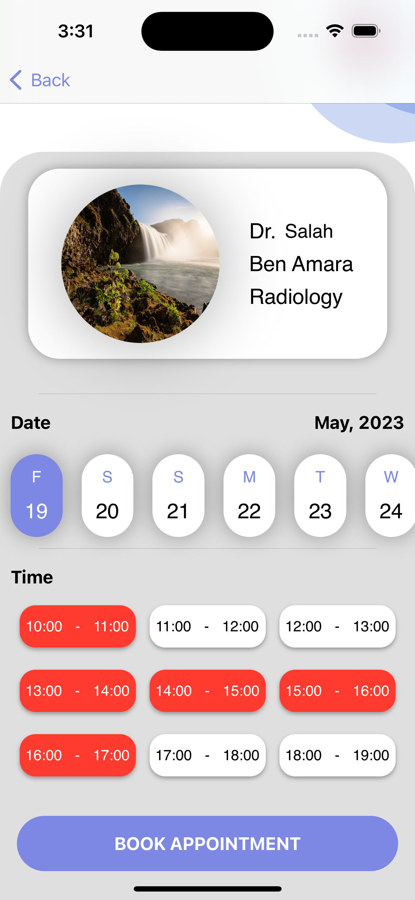

  <h1>ConsultPlus</h1>
  

        
        
        
        
      

      
A mobile app to help patients make instant appointments with doctors. Built with SwiftUI and Node.js, hosted on <a href="https://consult-plus-backend.onrender.com">https://consult-plus-backend.onrender.com</a>. Please wait at least 30 seconds to wake up the server.

      <h2>Installation</h2>
      <pre><code>git clone https://github.com/aouadimed/ConsultPlus-Ios.git</code></pre>
      <h2>License</h2>
      
This project is released under the MIT License.

      <h2>Contact</h2>
      
Feel free to reach out to aouadimed204@gmail.com with any questions or feedback.

      <a href="#" class="button">Back to Top</a>
